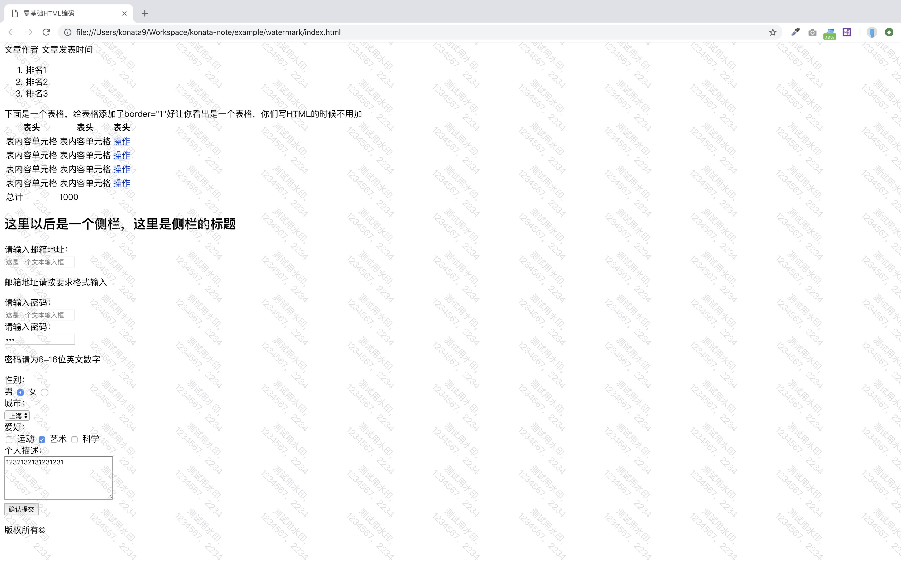

# 防截屏工具（页面打水纹）

## 背景
面试中被问到的一题，面试时虽然没答出来但是感觉很有趣。于是尝试着用自己的思路实现一下试试。结果最终采用的还是遮罩层实现（在面试中觉得遮罩层会影响后面的内容，所以第一个被排除了 T T）。其他还有 canvas、svg 实现。这里只实现了最简单的文字版本。

如何让遮罩层不影响后面页面的内容呢？要点在于 `css` 的 `pointer-events` 属性，只要将它设成 `none` 就不会影响后面的页面的操作了。
在网上找到的相关文章中，发现只要将 `opacity` 设为 0.005 这样就能做到肉眼不可见的效果了。用 PS 是可以查看出来的。因此又增加了 `invisible` 参数，用来控制是否可见。

js 的部分采用了类的写法，目前是半开放式状态。稍加改动就可以作为组件用在自己的项目中了。

## 使用实例
```javaScript
  var waterMark = new WaterMark('测试用水印，1234567|2234', { opacity: .3, rotate: 35 }, false)
  waterMark.create()
```

## 效果预览


## 参考资料
[阿里巴巴内网的不可见水印用的是什么算法？](https://www.zhihu.com/question/50677827)